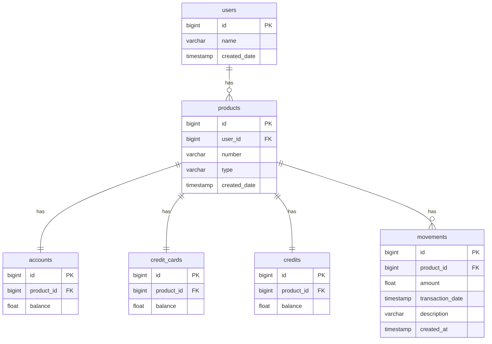

# GraphQL + Arquitectura Hexagonal

Este proyecto demuestra cómo implementar **GraphQL** utilizando una arquitectura **Hexagonal** en Java, integrando conceptos de diseño limpio y buenas prácticas, como la separación de capas y el uso de **paginación basada en cursor**, conforme a la especificación estándar de GraphQL.

---

## 📦 Tecnologías utilizadas

- Java 21
- GraphQL Java Tools
- Spring Boot
- Base de datos en memoria H2
- Gradle Wrapper

---

## 🧠 Objetivo del proyecto

Este proyecto está diseñado como un ejemplo práctico para entender cómo integrar GraphQL en una arquitectura hexagonal, con enfoque en consultas complejas y paginación eficiente tipo cursor. Es ideal para quienes desean aprender:

- Cómo organizar un proyecto GraphQL con una arquitectura limpia.
- Cómo implementar la paginación `Relay-style` en GraphQL.
- Cómo estructurar las capas de dominio, aplicación e infraestructura.

---

## 📁 Estructura del proyecto

```text
src
├── main
│   ├── java
│   │   └── com.ha.graphql
│   │       ├── application
│   │       │   ├── impl
│   │       │   └── port
│   │       ├── domain
│   │       │   ├── exception
│   │       │   ├── model.graphql
│   │       │   └── port
│   │       └── infrastructure
│   │           ├── driven
│   │           │   ├── mapper
│   │           │   └── persistence
│   │           │       ├── adapter
│   │           │       ├── entity
│   │           │       ├── model
│   │           │       └── repository
│   │           └── driving
│   │               ├── mapper
│   │               ├── model
│   │               └── rest
│   └── resources
│       ├── graphql
│       ├── graphql-client
│       ├── static
│       └── templates
```

---

## 🚀 Cómo ejecutar el proyecto

1. Clona este repositorio
2. Ejecuta el comando:

```bash
./gradlew clean compileJava bootRun
```

> 🧪 No es necesario configurar base de datos externa, ya que el proyecto utiliza H2 en memoria con datos pre-cargados mediante scripts incluidos.

---

## 🧪 Queries disponibles

```graphql
type Query {
    getProducts(filter: ProductFilter): [Product!]!
    getUser(id: ID): User!
    getAccount(productId: ID!): Account!
    getCreditCard(productId: ID!): CreditCard!
    getCredit(productId: ID!): Credit!
    getMovements(productId: ID!, first: Int, after: String, last: Int, before: String): MovementsConnection!
}
```

<details>
  <summary><strong>📌 Ejemplo completo de consulta</strong></summary>

```graphql
query GetMovements {
  getMovements(productId: "1", first: 5) {
    edges {
      cursor
      node {
        id
        transactionDate
        description
        amount
      }
    }
    pageInfo {
      startCursor
      endCursor
      hasNextPage
      hasPreviousPage
    }
  }
  getProducts(filter: { userId: 1 }) {
    id
    number
    type
  }
  getUser(id: "1") {
    id
    name
  }
  getAccount(productId: "1") {
    id
    balance
  }
  getCredit(productId: "4") {
    id
    balance
  }
}
```

</details>

---

## 🗃 Diagrama de relaciones de base de datos



---

## 📄 Estado del proyecto

✅ Proyecto finalizado  
🧪 Tests aún no implementados (opcional)

---

## 📚 Recursos adicionales

- [GraphQL Java Tools](https://github.com/graphql-java-kickstart/graphql-java-tools)
- [GraphQL Cursor Connections Specification](https://relay.dev/graphql/connections.htm)

---

¿Quieres contribuir o hacer mejoras? ¡Siéntete libre de hacer un fork o enviar un PR!
